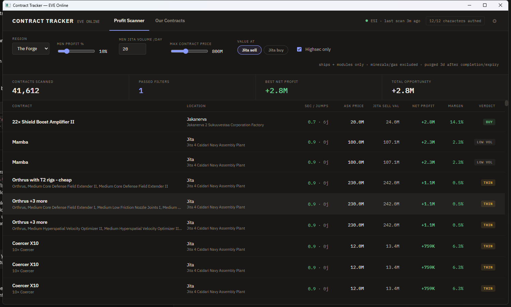
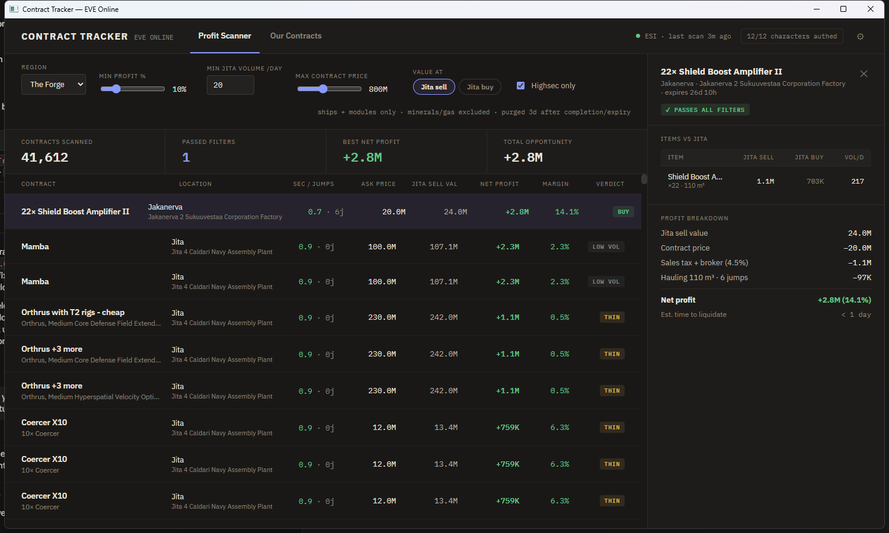
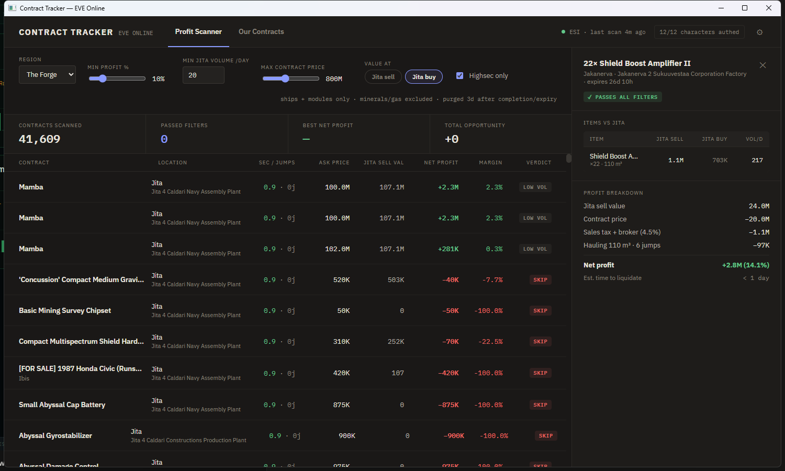
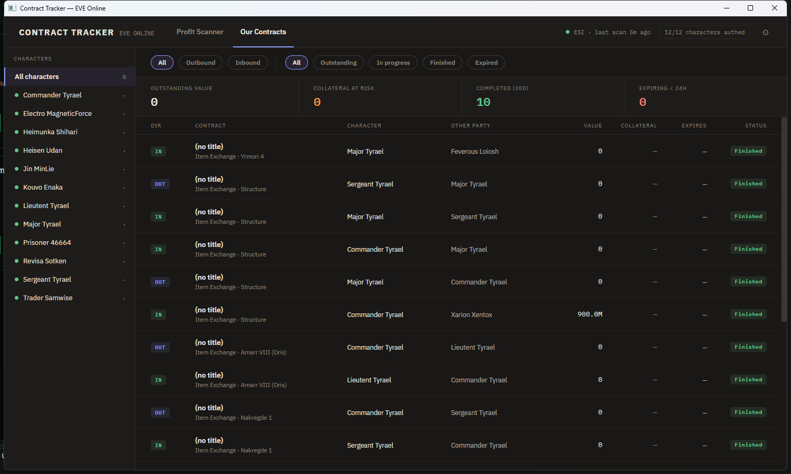
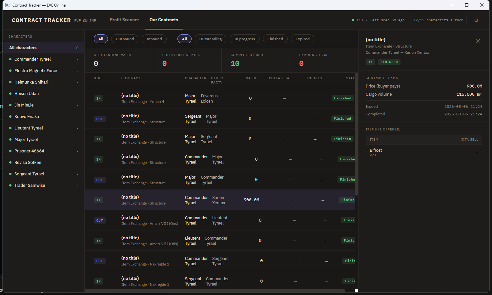
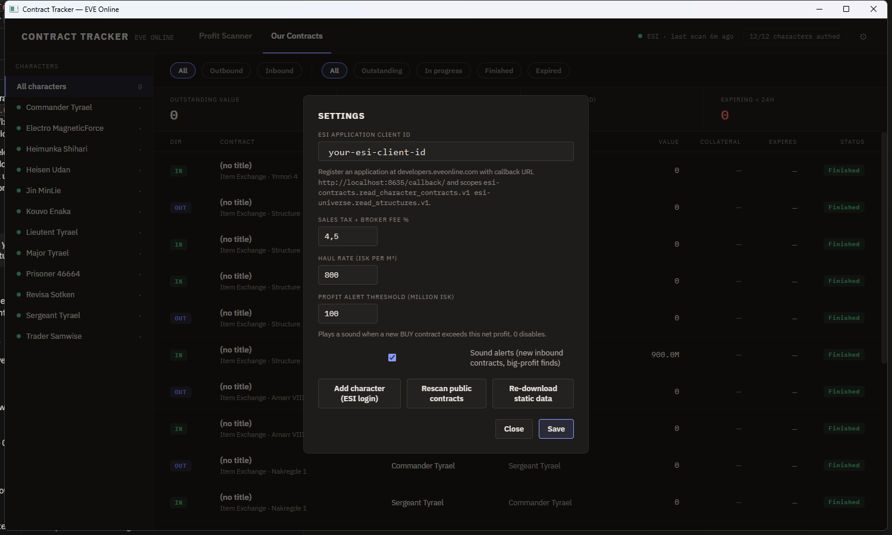

# EVE Contract Tracker

A Windows desktop app (.NET 10, WPF + Blazor Hybrid) for EVE Online contract work, with two jobs that share one local cache:

1. **Profit Scanner** — sweeps every public contract in a region, prices the contents against Jita 4-4, and surfaces the ones you can buy and resell at a real profit — with scam contracts identified and sunk to the bottom.
2. **Our Contracts** — one board for inbound/outbound contracts across 12+ authenticated characters, with terms, item manifests, and expiry tracking.

The UI is a pixel-faithful port of the design in [`design_handoff_contract_tracker/`](design_handoff_contract_tracker/README.md); the performance work that makes it feel instant is documented in [OPTIMIZATIONS.md](OPTIMIZATIONS.md).

---

## Profit Scanner



Every 30 minutes (matching ESI's own cache window — polling faster returns the same data) the app pulls all public contracts for the selected region, fetches item lists for contracts it has never seen, prices everything, and re-evaluates. The Forge is ~40,000 live contracts; a warm scan completes in about two seconds because item lists are immutable in EVE and are **fetched exactly once per contract, ever** — refetching known contracts would burn ESI's error budget for zero information.

Everything lands in a local SQLite cache, so the filter bar never touches the network:

- **Region** — The Forge, Domain, Sinq Laison, Heimatar, Metropolis. Switching triggers a background scan of the new region while cached rows show immediately.
- **Min profit %** — the margin below which a profitable contract is labeled `THIN` rather than `BUY`. Margin is measured against your capital outlay (`net profit / ask price`), because 10M profit on a 20M contract and on a 2B contract are very different trades.
- **Min Jita volume/day** — the liquidity floor. A contract only rates `BUY` if *every* item in it trades more than this per day in Jita; otherwise it's `LOW VOL`. Reasoning: profit you can't liquidate isn't profit — it's inventory. Per-item overrides exist in the database (`ItemSettings`) for things you know you can move.
- **Max contract price** — capital cap; anything above is excluded outright.
- **Highsec only** — pickup system security ≥ 0.5. Off by default only the verdict changes to `LOWSEC` so you can still see what you'd be flying into.

Filter changes answer from an in-memory snapshot in **~0.06 ms** — sliders feel like sliders, not database queries.

Scope is deliberately **ships and modules only** (minerals, gas, PI, etc. are excluded): commodity contracts compete against freighter-scale market traders on razor margins, while ship/module contracts are where mispricing and impatience actually create opportunities. Contracts purge 3 days after they finish or expire, keeping the database small forever.

### The verdict pipeline

Each contract gets exactly one verdict, evaluated in a fixed order so the *most disqualifying* reason wins:

| Verdict | Meaning |
|---|---|
| `EXCLUDED` | Not an item exchange, out of scope, want-to-buy, or over the price cap — never shown |
| `LOWSEC` | Pickup below 0.5 security (when highsec-only is on) |
| `SCAM` | Failed a scam heuristic — see below; sorts below everything else |
| `SKIP` | Net profit ≤ 0 |
| `LOW VOL` | Profitable, but an item is below the liquidity floor |
| `THIN` | Profitable and liquid, but under your margin threshold |
| `BUY` | Passes everything |

The economics: `net = Σ item value − ask price − fees − hauling`, where fees default to 4.5% (sales tax + broker on the resale) and hauling is `m³ × 800 ISK × (0.5 + jumps/10)` — a fixed handling overhead plus a per-jump component, using jump counts computed offline from the stargate graph (no route API calls). Contracts already in Jita haul for free.

### Scam protection — why the top of the list can be trusted

The naive version of this tool shows +60B "profit" at the top of the list all day. Public contracts are full of bait, and each pattern is closed off explicitly:

- **Fake sell walls** — an officer module with ~0 daily volume and a lone 60B sell order in Jita is not worth 60B; that order often belongs to the same person issuing the "bargain" contract. Any item below its volume floor is therefore valued at **Jita buy max** — the only price a dead market will actually pay you.
- **Free bait** — a 0-ISK contract offering positive value doesn't exist in nature. Verdict `SCAM`.
- **Swap scams** — contracts that *ask* for items in return are costed at the **Jita sell** price of those items (what acquiring them costs you), not the buy price. If a requested item has no market price at all, the contract can't be evaluated honestly: `SCAM`.
- **Too good to be true** — a >10× return on an *illiquid* item is noise on top of a fake valuation: `SCAM`. On a *liquid* item it's allowed through — genuinely mispriced hulls do happen — but flagged `⚑ TOO GOOD TO BE TRUE` so you look twice.
- **Fitted rigs are sunk cost** — rigs are destroyed on removal, so in any contract that also contains a ship, rig value is counted as **zero** and flagged `⚙ FITTED RIGS — SUNK COST`. A "cheap" rigged hull is priced exactly like the bare hull it can only ever be resold as. Loose rigs in rig-only contracts still price normally.
- **Title heuristics** — "cheap", "quick sale", ★ characters: flagged, never blocking (sellers with bad titles sometimes have good prices).

`SCAM` rows sort below everything regardless of their fantasy numbers, and the stats strip (passed / best / total opportunity) only ever counts `BUY` rows.

### Contract detail



Clicking a row opens the breakdown: every item with quantity, packaged m³, Jita sell/buy, and daily volume (red when below your floor); risk flags; and the full profit ledger — sell value, ask price, fees, hauling, net profit with margin, and an **estimated time to liquidate** derived from the slowest-moving item in the stack (`< 1 day` / `1–3 days` / `3–7 days`).

### Valuation basis: Jita sell vs Jita buy



The **Value at** toggle switches the entire evaluation between two philosophies:

- **Jita sell** (default) — you list the items and wait for them to sell. Liquid items are valued at the sell-order minimum; illiquid items still use buy max (the scam guard never relaxes).
- **Jita buy** — you dump everything into buy orders the moment you dock. This is the *instant-liquidation floor*: if a contract is still profitable on buy basis, the trade is essentially riskless.

The screenshot above shows the same Forge scan on buy basis: passed filters drops to zero and the market's true spread becomes visible. Switching re-evaluates all ~40k contracts in about half a second.

---

## Our Contracts



The second tab tracks the contracts your *own* characters are party to — every character authenticated via EVE SSO (OAuth2 PKCE; add as many as you like, the design targets 12+). Each character syncs every 5 minutes.

- **Character rail** — auth status dot (green = token valid, red = re-auth needed, with a re-auth link), active contract count per character. Click to filter; click again to clear.
- **Filters** — direction (Outbound = character issued it, Inbound = assigned to them) and status (Outstanding / In progress / Finished / Expired) pills, combinable with the character filter.
- **Stats** — outstanding value, courier collateral currently at risk, completed in the last 30 days, and anything expiring within 24 hours (red).

### Own-contract detail



Clicking a contract shows its complete terms — price, courier reward, collateral, auction buyout (only the fields that apply), cargo volume, delivery deadline, issued/completed dates — and the **item manifest**. Manifests are fetched from ESI on first click and cached permanently (contract contents are immutable), with identical stacks aggregated, items you'd *give away* marked `⇐ asked`, and a Jita sell reference per line where a price is known.

### Sound alerts

Two synthesized audio cues (no sound files, generated in-memory), each toggleable in Settings:

- **New inbound contract** — a soft two-note chime when a sync finds a contract newly assigned to any of your characters. A character's first-ever sync (the historical backfill) deliberately never fires it.
- **Big-profit find** — a rising arpeggio when a new `BUY` contract crosses your profit threshold (default 100M ISK). On startup the app baselines what's already on the board, so restarting never re-alerts old opportunities. Because only `BUY` rows qualify, the scam heuristics gate the alert too — the sound means *money*, not bait.

---

## Settings



- **ESI Client ID** — register an application at [developers.eveonline.com](https://developers.eveonline.com) with callback `http://localhost:8635/callback/` and scopes `esi-contracts.read_character_contracts.v1 esi-universe.read_structures.v1`, paste the ID, and add characters via the browser SSO flow. Refresh tokens are stored **DPAPI-encrypted** (current Windows user) in the local database — never in a file another user or machine could read.
- **Fee %** and **haul rate** — tune the profit model to your actual costs (accounting level, hauling alt vs. courier rates).
- **Profit alert threshold** and **sound alerts** toggle.
- **Rescan / re-download** — force a public-contract scan or a fresh static-data download without waiting for the schedules.

---

## Data flow & freshness

| What | Source | Cadence | Why |
|---|---|---|---|
| Public contracts | ESI `/contracts/public/{region}/` (ETag-aware) | 30 min | matches ESI's cache; a 304 costs nothing |
| Contract items | ESI `/contracts/public/items/{id}/` | once per contract, ever | items are immutable; refetching wastes error budget |
| Jita buy/sell | Fuzzwork aggregates (batched ~900 types/request) | hourly | one HTTP call replaces hundreds of ESI order pages |
| Prev-day volume | ESI market history, only in-scope items of live contracts | ~daily | history changes once per day; scoping cut calls ~10× |
| Static data (SDE) | Fuzzwork CSV dump (~40 MB) | 7 days | game patches change items; stale-but-present data never blocks startup |
| Own contracts | ESI per character (authenticated) | 5 min | matches ESI's cache for character contracts |

First run downloads the SDE (types, groups, packaged volumes, systems, stations, stargate graph) into `%LOCALAPPDATA%\EveContracts\sde`, computes jumps-to-Jita for every system with a single BFS over the stargate graph, and starts scanning — first usable rows appear within seconds while the rest of the region streams in (progress is durable; interrupting costs at most one 500-contract chunk).

---

## Install & auto-update

Grab `ContractTracker-win-Setup.exe` from the latest [Release](../../releases) (or the installer artifact of any [Actions run](../../actions)) and run it — installs per-user, no admin. Installed copies check GitHub Releases on startup and every 6 hours; when a new version exists, an **⬆ update chip** appears in the header — one click downloads (delta packages when available) and restarts into the new version. Dev and portable-zip runs never self-update.

Releasing a new version:

```powershell
.\scripts\release.ps1             # patch bump; or: minor | major | 1.4.0, -Watch to follow CI
```

The script bumps `<Version>` in the csproj, runs the tests, commits, tags `vX.Y.Z`, and pushes — CI builds, tests again, and publishes the installer, update packages, and a portable zip to the GitHub Release.

## Build from source

```
dotnet build
dotnet run --project src/EveContracts.App
```

Requires the .NET 10 SDK and the WebView2 runtime (preinstalled on Windows 11).

```
src/EveContracts.Core     domain, EF Core/SQLite cache, ESI client + OAuth, SDE loader, evaluation
src/EveContracts.App      WPF Blazor Hybrid UI (Razor components + design-token CSS), sounds, auto-update
tests/EveContracts.Tests  evaluation pipeline (incl. every scam rule), ISK formatting, CSV parser
tests/EveContracts.Bench  performance harness for the scanner pipeline
```

## License

[MIT](LICENSE). If you fork this, change the ESI User-Agent contact in `App.xaml.cs` to your own — CCP asks that ESI clients identify their maintainer.
